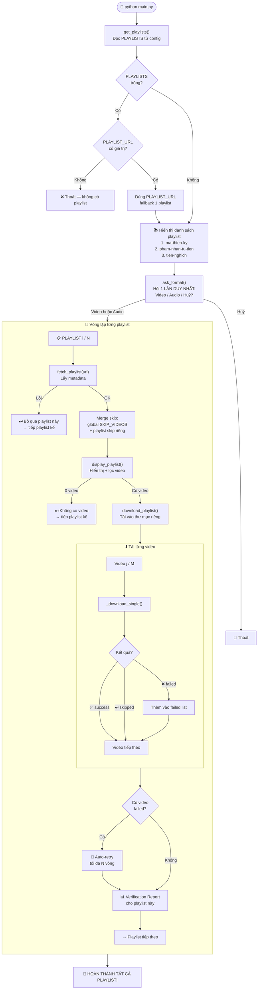
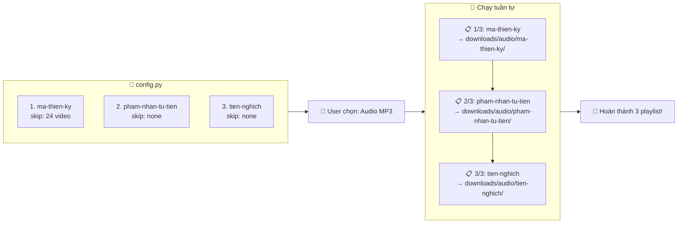

# Flow: Tải nhiều playlist

## Tổng quan



## Ví dụ cụ thể với 3 playlist



## Cấu trúc thư mục output

```
downloads/
├── audio/
│   ├── ma-thien-ky/          ← Playlist 1
│   │   ├── Chương 001.mp3
│   │   ├── Chương 002.mp3
│   │   └── ...
│   ├── pham-nhan-tu-tien/    ← Playlist 2
│   │   ├── Tập 001.mp3
│   │   └── ...
│   └── tien-nghich/          ← Playlist 3
│       ├── Tập 001.mp3
│       └── ...
├── archive.txt               ← Chung cho tất cả (skip video đã tải)
└── error.log                 ← Log lỗi chung
```

> [!NOTE]
> - **Hỏi format 1 lần** → áp dụng cho tất cả playlist
> - **Mỗi playlist lỗi** → bỏ qua, không dừng cả script
> - **Archive chung** → video đã tải ở playlist nào cũng được skip
> - **Skip merge** = `SKIP_VIDEOS` global + `skip` riêng từng playlist
